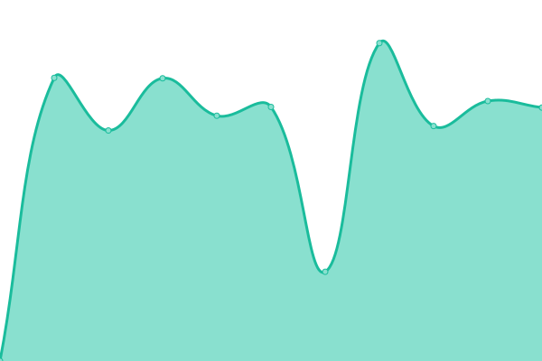

# [📈 Live Status](https://status.cacic.bsb.br): <!--live status--> **🟧 Partial outage**

This repository contains the open-source uptime monitor and status page for [Jesusaves](https://gitlab.com/jesusalva), powered by [Upptime](https://github.com/upptime/upptime).

With [Upptime](https://upptime.js.org), you can get your own unlimited and free uptime monitor and status page, powered entirely by a GitHub repository. We use [Issues](https://github.com/pazkero/status.cacic.bsb.br/issues) as incident reports, [Actions](https://github.com/pazkero/status.cacic.bsb.br/actions) as uptime monitors, and [Pages](https://status.cacic.bsb.br) for the status page.

<!--start: status pages-->
<!-- This summary is generated by Upptime (https://github.com/upptime/upptime) -->
<!-- Do not edit this manually, your changes will be overwritten -->
<!-- prettier-ignore -->
| URL | Status | History | Response Time | Uptime |
| --- | ------ | ------- | ------------- | ------ |
|  [[VM] Agnus Dei](75.119.128.234) | 🟩 Up | [vm-agnus-dei.yml](https://github.com/pazkero/status.cacic.bsb.br/commits/HEAD/history/vm-agnus-dei.yml) | 

 113ms
     
 | 

<a href="https://status.cacic.bsb.br/history/vm-agnus-dei">100.00%</a>
    

|  [Alumni](https://alumni.cacic.bsb.br) | 🟩 Up | [alumni.yml](https://github.com/pazkero/status.cacic.bsb.br/commits/HEAD/history/alumni.yml) | 

 1842ms
     
 | 

<a href="https://status.cacic.bsb.br/history/alumni">100.00%</a>
    

|  [Website](https://cacic.bsb.br) | 🟩 Up | [website.yml](https://github.com/pazkero/status.cacic.bsb.br/commits/HEAD/history/website.yml) | 

 1146ms
     
 | 

<a href="https://status.cacic.bsb.br/history/website">100.00%</a>
    

|  [SIGAA](https://sig.unb.br/sigaa/) | 🟩 Up | [sigaa.yml](https://github.com/pazkero/status.cacic.bsb.br/commits/HEAD/history/sigaa.yml) | 

 2389ms
     
 | 

<a href="https://status.cacic.bsb.br/history/sigaa">100.00%</a>
    

|  [SEI](https://sei.unb.br/) | 🟩 Up | [sei.yml](https://github.com/pazkero/status.cacic.bsb.br/commits/HEAD/history/sei.yml) | 

 1080ms
     
 | 

<a href="https://status.cacic.bsb.br/history/sei">100.00%</a>
    

|  [Moodle](https://aprender3.unb.br/login/index.php) | 🟩 Up | [moodle.yml](https://github.com/pazkero/status.cacic.bsb.br/commits/HEAD/history/moodle.yml) | 

 1470ms
     
 | 

<a href="https://status.cacic.bsb.br/history/moodle">99.80%</a>
    

|  [Teams](https://teams.microsoft.com/) | 🟩 Up | [teams.yml](https://github.com/pazkero/status.cacic.bsb.br/commits/HEAD/history/teams.yml) | 

 49ms
     
 | 

<a href="https://status.cacic.bsb.br/history/teams">100.00%</a>
    

|  [Ouvidoria](https://ouvidoria.unb.br/) | 🟩 Up | [ouvidoria.yml](https://github.com/pazkero/status.cacic.bsb.br/commits/HEAD/history/ouvidoria.yml) | 

 3752ms
     
 | 

<a href="https://status.cacic.bsb.br/history/ouvidoria">100.00%</a>
    

|  [Restaurante](https://ru.unb.br/index.php/cardapio) | 🟩 Up | [restaurante.yml](https://github.com/pazkero/status.cacic.bsb.br/commits/HEAD/history/restaurante.yml) | 

 3355ms
     
 | 

<a href="https://status.cacic.bsb.br/history/restaurante">100.00%</a>
    

|  [Departamento](http://cca.unb.br/) | 🟥 Down | [departamento.yml](https://github.com/pazkero/status.cacic.bsb.br/commits/HEAD/history/departamento.yml) | 

 2646ms
     
 | 

<a href="https://status.cacic.bsb.br/history/departamento">82.93%</a>
    

|  [[Yandex] inbound mail](mx.yandex.net) | 🟩 Up | [yandex-inbound-mail.yml](https://github.com/pazkero/status.cacic.bsb.br/commits/HEAD/history/yandex-inbound-mail.yml) | 

 173ms
     
 | 

<a href="https://status.cacic.bsb.br/history/yandex-inbound-mail">100.00%</a>
    

|  [[Yandex] outbound mail](smtp.yandex.com) | 🟩 Up | [yandex-outbound-mail.yml](https://github.com/pazkero/status.cacic.bsb.br/commits/HEAD/history/yandex-outbound-mail.yml) | 

 226ms
     
 | 

<a href="https://status.cacic.bsb.br/history/yandex-outbound-mail">100.00%</a>
    

|  [Conselho Legal](https://adac.bsb.br) | 🟩 Up | [conselho-legal.yml](https://github.com/pazkero/status.cacic.bsb.br/commits/HEAD/history/conselho-legal.yml) | 

 1280ms
     
 | 

<a href="https://status.cacic.bsb.br/history/conselho-legal">100.00%</a>
    

|  [Conselho de TI](https://moubootaurlegends.org) | 🟩 Up | [conselho-de-ti.yml](https://github.com/pazkero/status.cacic.bsb.br/commits/HEAD/history/conselho-de-ti.yml) | 

 489ms
     
 | 

<a href="https://status.cacic.bsb.br/history/conselho-de-ti">100.00%</a>
    

<!--end: status pages-->

[**Visit our status website →**](https://status.cacic.bsb.br)

## 📄 License

- Powered by: [Upptime](https://github.com/upptime/upptime)
- Code: [MIT](./LICENSE) © [Jesusaves](https://gitlab.com/jesusalva)
- Data in the `./history` directory: [Open Database License](https://opendatacommons.org/licenses/odbl/1-0/)
